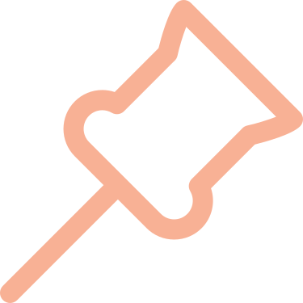

<!-- 
<h1>Hi, I'm Anish Kacham 👋</h1> 
 -->

  

   &nbsp
   &nbsp
   &nbsp
   &nbsp 
   &nbsp 
   &nbsp  

 Hyderabad, India 

<h3>Welcome to my github page. I'm currently pursuing my bachelor's degree in Computer Science from BITS Pilani</h3>

<h3>.o0 work in progress 🛠️ 0o. </h3>
   

<!--
**AnishKacham/AnishKacham** is a ✨ _special_ ✨ repository because its `README.md` (this file) appears on your GitHub profile.

Here are some ideas to get you started:

- 🔭 I’m currently working on ...
- 🌱 I’m currently learning ...
- 👯 I’m looking to collaborate on ...
- 🤔 I’m looking for help with ...
- 💬 Ask me about ...
- 📫 How to reach me: ...
- 😄 Pronouns: ...
- ⚡ Fun fact: ...
-->
